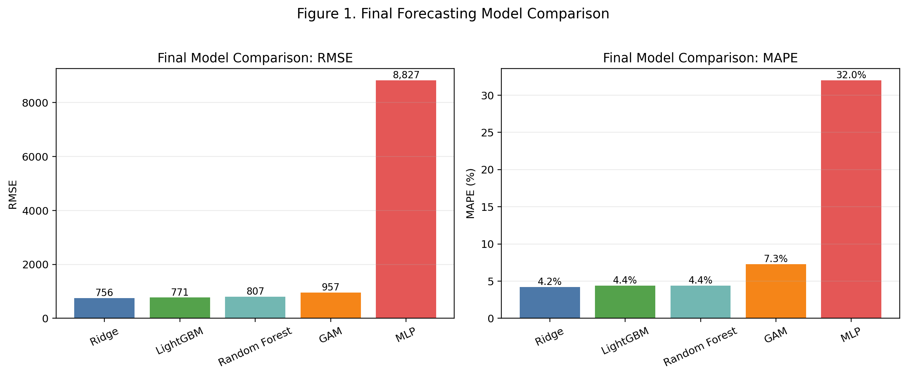
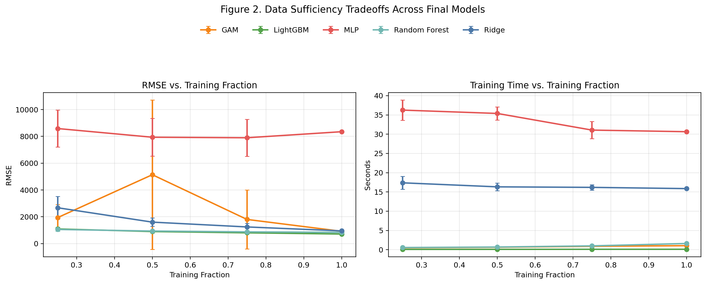

# Retail Demand Forecasting Memo Draft

## Stakeholder

Our primary stakeholder is a retail planning and inventory management team responsible for short-term demand planning across Walmart store-category combinations. This audience needs forecasts that are accurate enough to support weekly replenishment and allocation decisions, but also stable, interpretable, and practical to maintain. For this stakeholder, the key question is not simply which model is most sophisticated, but which modeling approach gives the best balance of forecast quality, robustness, and operational simplicity.

## Executive Summary

We developed and compared a range of forecasting models for weekly retail demand at the store-category level using the M5 Walmart sales data. The goal was to identify a forecasting approach that could support short-term planning decisions while remaining reliable under realistic data constraints. Across the final model set, the best overall performance came from regularized linear and tree-based methods. Ridge achieved the strongest held-out accuracy overall, while LightGBM and Random Forest performed nearly as well and showed strong stability. In contrast, the multilayer perceptron (MLP) neural network consistently underperformed and did not justify its added complexity.

A second objective of the project was to evaluate data sufficiency: how much historical data is needed before model performance becomes stable, and whether training on only the highest-volume combinations can substitute for using the full dataset. These experiments showed that LightGBM was the most data-efficient and stable model as training history increased, while Ridge became highly competitive once enough history was available. Training only on the highest-volume subset generally worsened performance, indicating that lower-volume combinations still contain useful predictive structure. Taken together, the project suggests that a well-tuned tabular model, particularly Ridge or LightGBM, is the strongest practical choice for this forecasting setting.

## Decisions to Be Made

The main decision for the stakeholder is which model family should be adopted for weekly forecasting going forward. Based on the results, the strongest candidates are Ridge and LightGBM. Ridge offers the best overall held-out accuracy and remains relatively simple and interpretable. LightGBM offers nearly equivalent accuracy while performing better in reduced-data settings and maintaining very fast training time. A second decision is whether to restrict modeling to only the highest-volume store-category combinations. Our findings suggest that this would not be advisable, since models trained on the full dataset generally generalized better than those trained only on the Pareto subset. Finally, the stakeholder should decide how much emphasis to place on absolute versus percentage-based errors. Because sales volumes vary substantially across store-category combinations, percentage-based metrics provide a more balanced view of comparative performance across the portfolio.

## Report

This project forecasted weekly demand for aggregated store-category combinations rather than individual items, creating a problem that is operationally meaningful while still manageable for model comparison. We evaluated baseline forecasting rules, regularized linear models, tree ensembles, a generalized additive model (GAM), and a neural network benchmark. This allowed us to compare model behavior across increasing levels of complexity while holding the forecasting task and feature set as consistent as possible.

The main model comparison produced a clear ranking. Ridge had the best held-out performance, with RMSE of 756 and MAPE of 4.2%. LightGBM and Random Forest followed closely, with RMSE of 771 and 807 respectively, and both at 4.4% MAPE. GAM performed reasonably well but was clearly weaker than the top tabular models, while the MLP performed dramatically worse than all other approaches. This pattern suggests that the predictive signal in this dataset is captured well by structured tabular models and that additional neural-network flexibility does not translate into better forecasts in this setting.

| Model | RMSE | MAPE | R² |
| --- | ---: | ---: | ---: |
| Ridge | 756 | 4.2% | 0.9913 |
| LightGBM | 771 | 4.4% | 0.9909 |
| Random Forest | 807 | 4.4% | 0.9900 |
| GAM | 957 | 7.3% | 0.9860 |
| MLP | 8827 | 32.0% | -0.1916 |

These aggregate results should be interpreted carefully because demand volume differs substantially across store-category combinations. Scale-dependent metrics such as RMSE and MAE are heavily influenced by high-volume categories, especially FOODS. For that reason, percentage-based metrics such as MAPE are especially useful for comparing model quality across heterogeneous combinations. Under that lens, the same overall conclusion holds: Ridge, LightGBM, and Random Forest clearly outperformed the GAM and MLP.

The data sufficiency analysis added an important practical dimension to the project. Each final model was retrained using 25%, 50%, 75%, and 100% of the available training history, using repeated contiguous historical windows to preserve the time-series structure of the problem. These experiments showed that LightGBM was the most stable and data-efficient model, improving smoothly from RMSE 1093 at 25% of the data to 716 at full data. Random Forest followed a similar pattern but remained slightly weaker. Ridge was more sensitive to limited history, but improved substantially once more data became available, which suggests that it needs a longer training window to reach peak performance. GAM was less stable under reduced-data conditions, and the MLP remained poor at all data fractions.

| Model | RMSE at 25% | RMSE at 50% | RMSE at 75% | RMSE at 100% |
| --- | ---: | ---: | ---: | ---: |
| LightGBM | 1093 | 900 | 806 | 716 |
| Random Forest | 1055 | 937 | 876 | 839 |
| Ridge | 2675 | 1602 | 1243 | 949 |
| GAM | 1942 | 5139 | 1803 | 917 |
| MLP | 8585 | 7936 | 7897 | 8349 |

We also tested whether training only on the highest-volume store-category combinations would preserve most of the useful signal. In general, it did not. For LightGBM, RMSE worsened from 716 on the full dataset to 1195 on the Pareto subset. Random Forest showed the same pattern, worsening from 839 to 1106. GAM also declined. Ridge was the only partial exception: its RMSE increased, but its percentage error stayed relatively stable. Overall, these findings indicate that lower-volume combinations still contribute meaningful structure, so the full dataset is more valuable than a concentrated high-volume subset.

From a stakeholder perspective, the recommendation is straightforward. If the priority is strongest overall predictive accuracy with interpretability and a straightforward modeling pipeline, Ridge is the best choice. If the priority is robustness under limited data, strong performance, and fast retraining, LightGBM is the best choice. The MLP is not recommended for deployment in its current form, as it adds substantial complexity without improving results. The appendix provides the technical details of feature engineering, model tuning, SHAP analysis, and evaluation diagnostics that support these conclusions.

## Figure Sources

Figure 1: [figure_1_final_model_comparison.png](figures/figure_1_final_model_comparison.png). Generated for the memo from the final saved-model comparison results summarized in `notebooks/models/11_data_sufficiency.ipynb`.

Figure 2: [figure_2_data_sufficiency_tradeoffs.png](figures/figure_2_data_sufficiency_tradeoffs.png). Generated for the memo from the Section 5 reduced-data experiment results in `notebooks/models/11_data_sufficiency.ipynb`.
